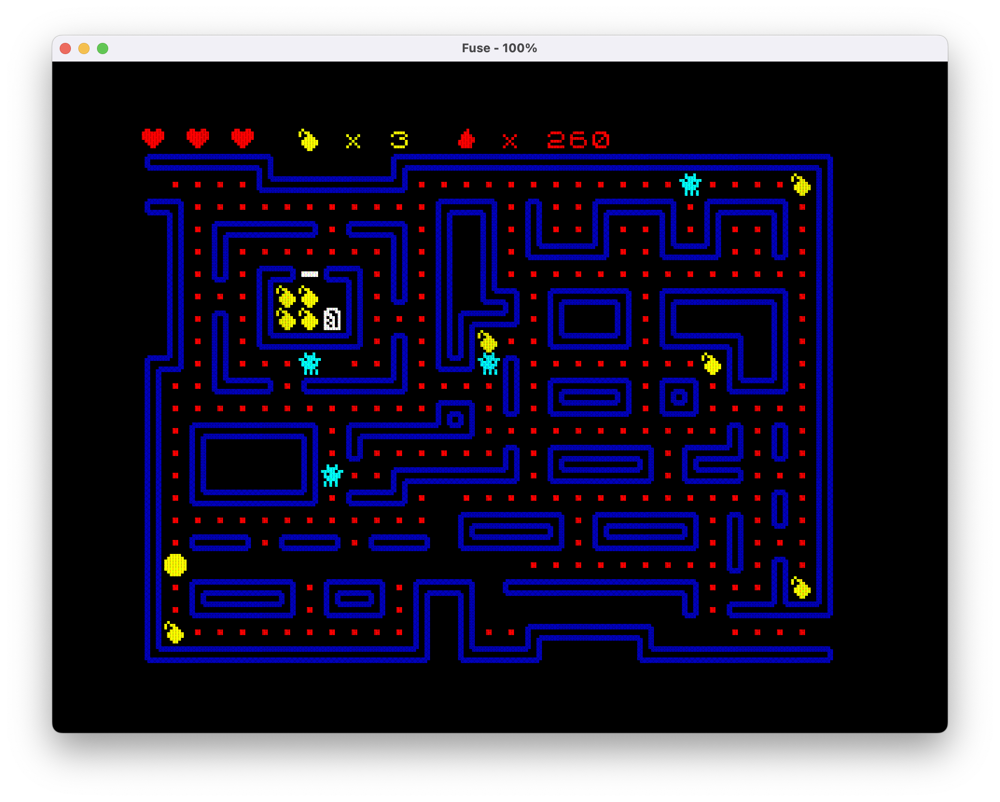

## Pacbomber

Arcade game - combination of pacman and bomberman for ZX Spectrum 48K, suitable for beginners to experiment with making games for ZX Spectrum.

The game is written in [ZX Basic](https://github.com/boriel/zxbasic), the graphics for the first screen are drawn in [ZX-Paintbrush](https://sourcesolutions.itch.io/zx-paintbrush), the graphics in the game with the help of http://www.amelyn.com/speccy_character_builder/

To create a level, install the [Tiled](https://www.mapeditor.org) level editor Once you have created your first level, export it to CSV and then use the Python script from the tools/csv2bas.py directory.

What are the shortcomings and wishes:
- 5 clock delay is used to organize the movement of objects, it makes sense to use a counter;
- bomb explosion may not hit the enemy Ghoul - it makes sense to add a two-dimensional array that fills and through it display blocks that have an explosion and through it to check for collision.